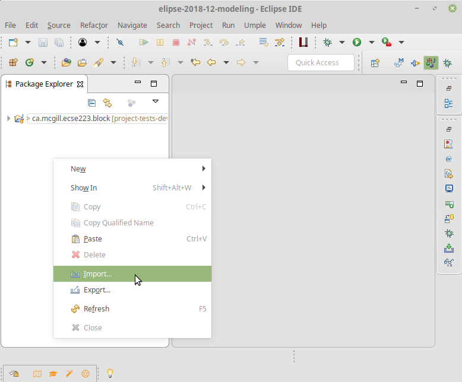
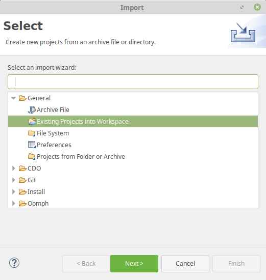
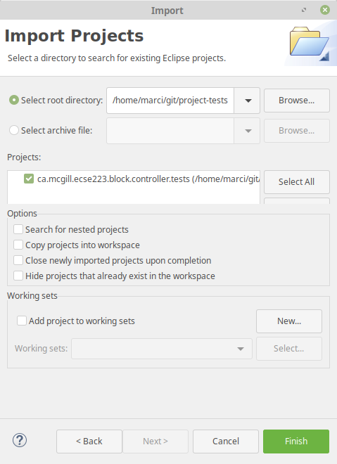
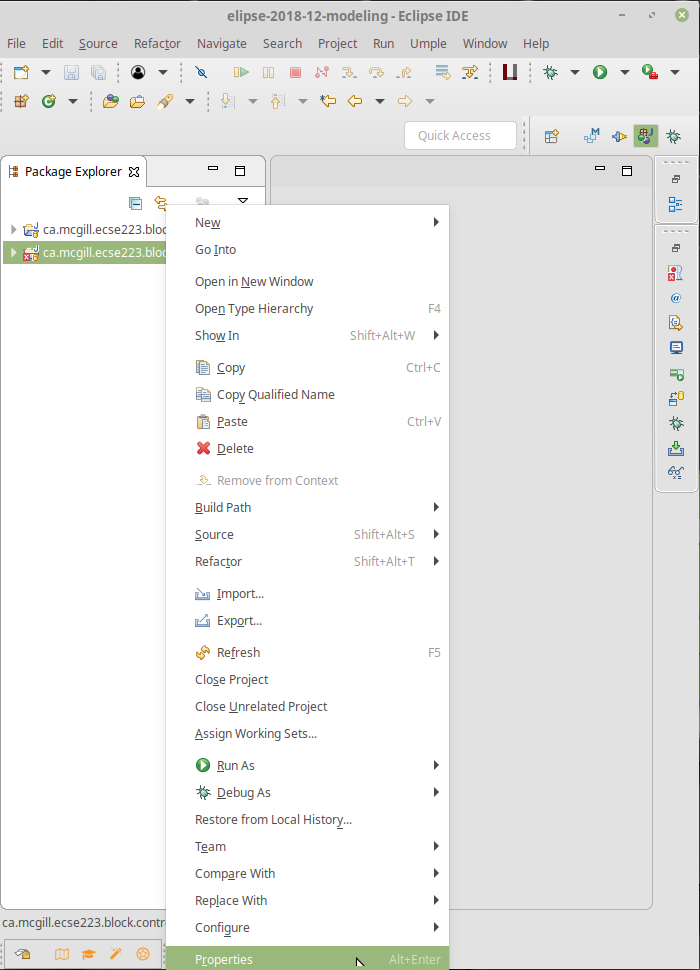
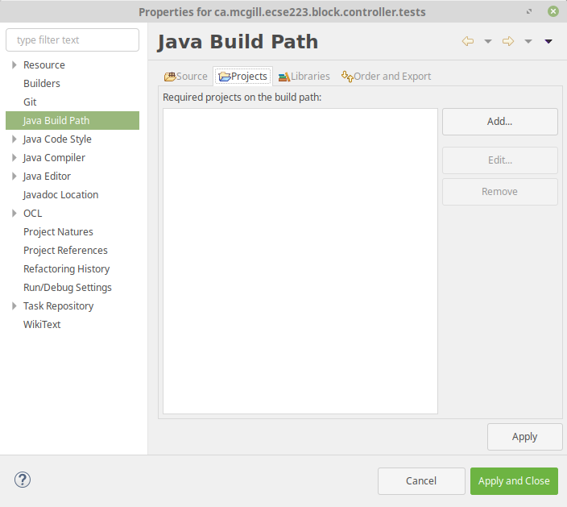
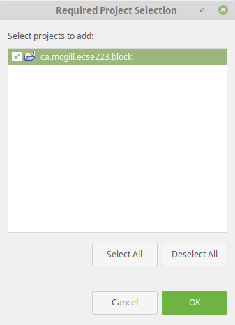
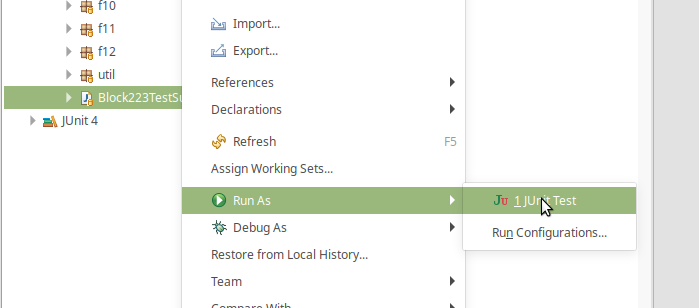

# ECSE223 Project Tests

This repository contains the tests provided as part of the ECSE223 group project.

## Steps to import the test project

1. Get the project by cloning the `project-tests` repository from https://github.com/W2019-ECSE223/project-tests.git
2. Open Eclipse, then right click on the Package Explorer and select _Import..._  

3. Select _Existing projects into Workspace_  

4. Browse the file system for the _ca.mcgill.ecse223.block.controller.tests_ folder and select it  

5. Click _Finish_
6. You will have a new project _ca.mcgill.ecse223.block.controller.tests_ in the workspace with errors
7. We fix the errors in multiple steps, the first is to select the project _Properties_  

8. Go to _Java build path_ and select the _Projects_ tab  

9. Click on _Add..._ and browse your Block223 project (in the example, it is named _ca.mcgill.ecse223.block_)  

10. Click on _OK_, then _Apply and Close_ - Test project setup done, there should be no errors remaining. If there are still errors, it means you have not implemented some methods in the controller/application class

## Running the tests

Running the tests is simple. Browse the tests project for the class named `Block223TestSuite`, then right click on it, and in the context menu select _Run as... -> JUnit test_.  

